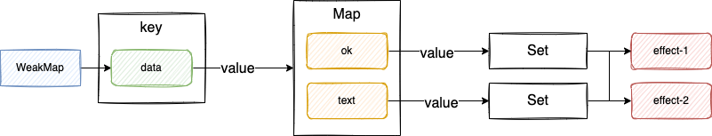

# minimal-vue

## reactivity

### 最基础的响应式数据

[代码实现](https://github.com/Ge-yuan-jun/minimal-vue/commit/ffdd07d2c223f1d8ab31fda7b045764a89973f1d)

### 副作用函数与 proxy 实现解耦

[代码实现](https://github.com/Ge-yuan-jun/minimal-vue/blob/543172d95762aeeb8432dcbb3bea9a143a41bc73/reactivity/index.ts)

### 副作用函数与被操作的目标字段之间简历明确的联系

[代码实现](https://github.com/Ge-yuan-jun/minimal-vue/blob/d79236c3fa16bfb1e58cf135d32cd341cf9e3bc0/reactivity/index.ts)

主要思路：利用 WeakMap + Map 实现一个树形结构


### 响应式数据在进行分支切换时的处理

场景如下：

```javascript
const data = { ok:true, text: 'hello world }
const obj = new Proxy(data, { /* ... */ })

effect(function effectFn() {
  document.body.innerText = obj.ok ? obj.text : 'not
})

obj.ok = false
```

<!-- [代码实现]() -->
