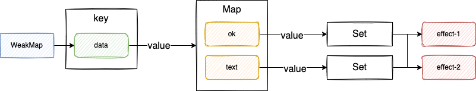

### reactivity

#### 最基础的响应式数据

[代码实现](https://github.com/Ge-yuan-jun/minimal-vue/commit/ffdd07d2c223f1d8ab31fda7b045764a89973f1d)

#### 副作用函数与 proxy 实现解耦

[代码实现](https://github.com/Ge-yuan-jun/minimal-vue/blob/543172d95762aeeb8432dcbb3bea9a143a41bc73/reactivity/index.ts)

#### 副作用函数与被操作的目标字段之间简历明确的联系

[代码实现](https://github.com/Ge-yuan-jun/minimal-vue/blob/d79236c3fa16bfb1e58cf135d32cd341cf9e3bc0/reactivity/index.ts)

主要思路：利用 WeakMap + Map 实现一个树形结构


#### 响应式数据在进行分支切换时的处理

场景如下：

```javascript
const data = { ok:true, text: 'hello world }
const obj = new Proxy(data, { /* ... */ })

effect(function effectFn() {
  document.body.innerText = obj.ok ? obj.text : 'not
})

obj.ok = false
```

分支切换会导致冗余副作用，进行不必要的更新。需要在每次副作用重新执行之前，清理上一次简历的响应联系。当副作用函数重新执行之后，再次新的响应联系。

[代码实现](https://github.com/Ge-yuan-jun/minimal-vue/blob/18bfa8a01bb1f26234c3c02669def663a7f56952/reactivity/index.js)


#### 响应式数据如果存在嵌套怎么处理？

[代码实现](https://github.com/Ge-yuan-jun/minimal-vue/blob/d4e25a51f0d6336e0cfe50dc2415ef27b452c0d5/reactivity/index.js)

主要思路是新增一个栈，栈底存储外层副作用函数，栈顶存储内层副作用函数

#### 如何业务代码导致的无限递归循环？

如果 trigger 触发执行的副作用函数与当前正在执行的副作用函数相同，则不触发执行

[代码实现](https://github.com/Ge-yuan-jun/minimal-vue/blob/0cb5eab316a1014ba65eb487d89cc1fafc6523c2/reactivity/index.js)

#### 如何实现自定义调度执行？

可调度性：用户可以通过调用调度器自行完成任务的调度

[代码实现](https://github.com/Ge-yuan-jun/minimal-vue/blob/66ad73111b3ff2ab77e508a2c3f59b9f6ab46630/reactivity/index.js)

#### 如何实现 computed、watch？

这两者的实现都依赖 lazy 特性的实现：具体原理是只在需要的时候才手动调用副作用函数，或者其值

computed 本质实际上是一个懒执行的副作用函数

[computed 代码实现](https://github.com/Ge-yuan-jun/minimal-vue/blob/2868cfe3181c4cdd73bc5715532877adef58e9fe/reactivity/index.js)

watch 本质上利用了副作用函数重新执行时的可调度性

[watch 代码实现](https://github.com/Ge-yuan-jun/minimal-vue/blob/4d19fc6f4f39abeb7702cc89554bc91c1027a7bc/reactivity/index.js)